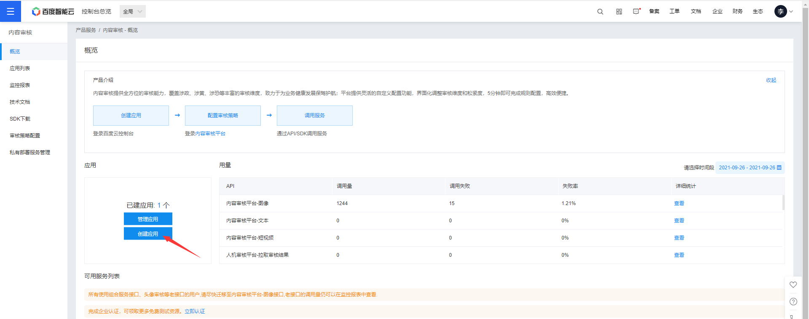
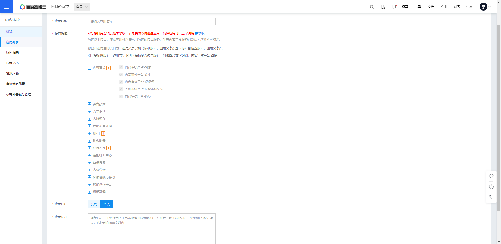
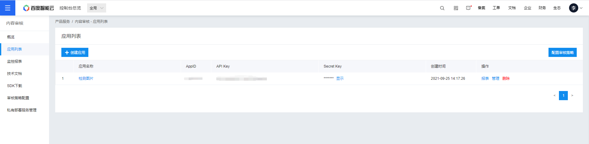
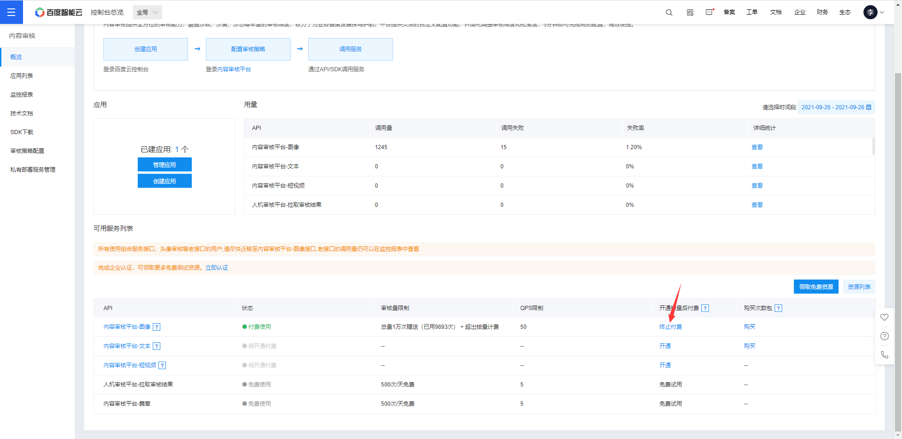
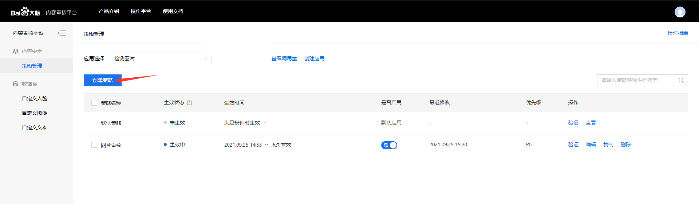
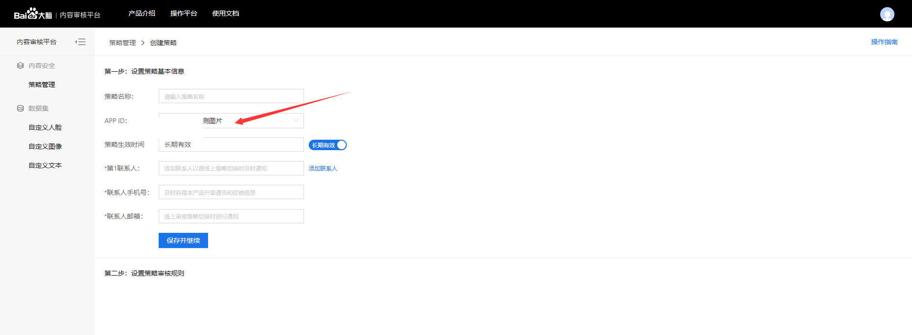
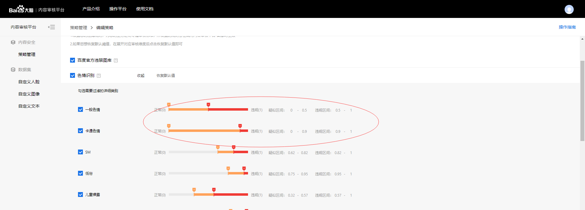
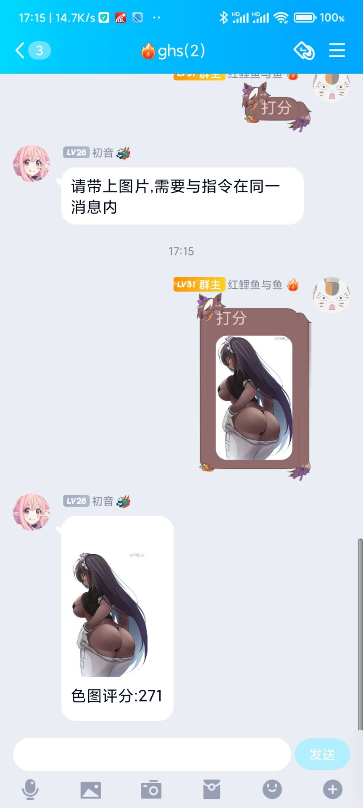

# SetuScore
一个为色图打分的插件

## 使用说明

在 https://cloud.baidu.com/product/imagecensoring 页面开通服务

开通后进入管理台创建应用

名称和描述随便填一下就行

记住你的AppID, Api Key, Secret Key,填入`setu_score.py`里对应的位置

开通图片审核服务,有免费一万次记得领一下,用完的话就往账号里存十块钱,够用很久了

进入 https://ai.baidu.com/censoring#/strategylist 页面创建策略

这里应用选你刚才创建那个

色情拉满,然后在页面最下面保存策略

使用`pip install baidu-aip`指令安装SDK

把文件夹放入`modules`中并在`__bot__.py`中添加该插件

效果图:

## 功能
|指令|说明|
|-----|-----|
|打分|让机器人为图片打分,图片与指令需要在同一消息内|

## 致谢
连续对话代码参考(嗯缝)了 https://github.com/pcrbot/picfinder_take